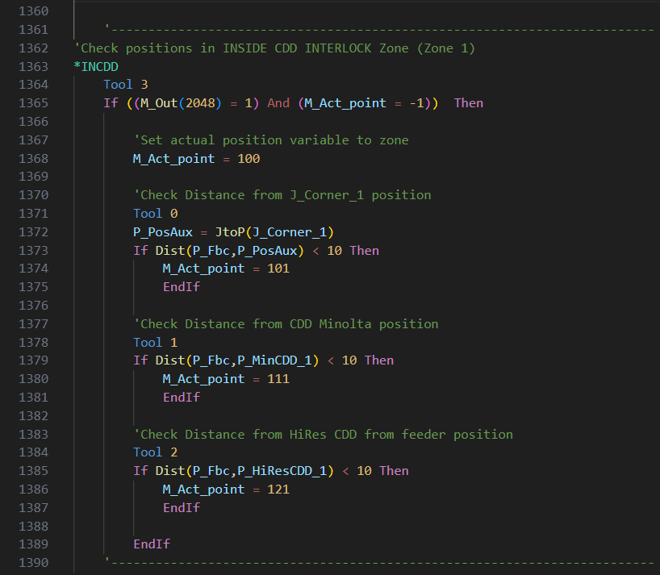

# MELFA-Basic language extension

**Mitsubishi robot programming language support for VS Code**

*Open melfa codes in VS Code, write then jump to RT Toolbox for upload.*

## Features

- Syntax highlight
- Snippets
- Custom color theme
- 2 type formatters (additional extension required)
<br>
<br>




### Requirements

- Python (or you can use formatter.exe instead)
- [Custom Local Formatters](https://marketplace.visualstudio.com/items?itemName=jkillian.custom-local-formatters)

## Setup and usage

**Soon on marketplace**

#### Manual installation:

Clone the repo to `C:\Users\%userprofile%\AppData\Local\Programs\Microsoft VS Code\resources\app\extensions\`

### Activate theme

`Ctrl + Shift + P` --> `Preferences: Color Theme` --> `Dark Theme for MELFA-Basic`


## Activate 'deformer'

Install [Custom Local Formatters](https://marketplace.visualstudio.com/items?itemName=jkillian.custom-local-formatters)

Open settings.json *([Ctrl + , ] -> custom local formatters -> `edit in settings.json`)*

Paste:
```
"customLocalFormatters.formatters": [
        {
            "command":"python \"%localappdata%\\Programs\\Microsoft VS Code\\resources\\app\\extensions\\MELFA-Basic\\formatter\\deformerV2.py\"",
            "languages": ["melfa-basic"]
        }
    ],
```
**Deformer usage:**

`Ctrl + Shift + P` **-->** `Format document with...` **-->** `Custom Local Formatters`

## How formatter works

- Removes the line numbers and ' in empty lines
- Adjust spaces

Indent with the following logic:
- Standard indentation rules for conditions and loops
- Indent label based subroutines with '--- endings

### Deformer

Formats the code for RT Toolbox.
- Insert line numbers (Toolbox will readjust)
- Comment empty lines so Toolbox won't delete them

> Please open an issue if you found bugs or suggest features.
